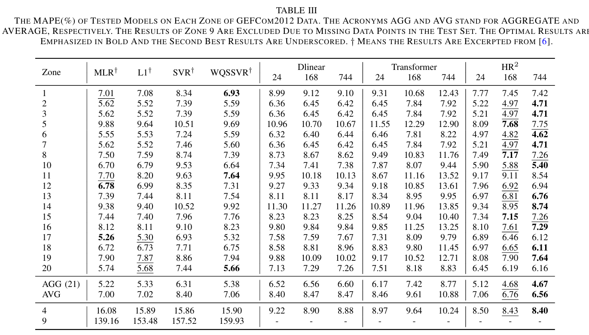
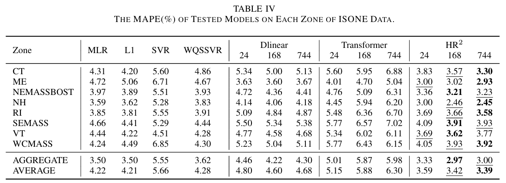

# HR$^2$:  A Novel Hierarchical Residual Regression Framework for Load Forecasting

Note this is not a cleaned repo.

## Abstract

Electric load forecasting serves as the foundation for various power system analyses, ensuring reliable operations and management of intelligent power grids. Various load forecasting methods and techniques have been proposed for load forecasting during the past decades. These methods have some limitations, including time-consuming, unextendable, and unrepeatable feature engineering procedures to construct input features. To handle these limitations, we propose a novel Hierarchical Residual Regression (HR$^2$) framework for load forecasting, which is a deep-learning-based framework that directly learns a unified representation from raw features and captures the inherent correlation across features and temporal information via hierarchical residual layers as follows. The continuous and discrete features are first mapped to a unified high-dimensional embedding space, with a residual block built on convolution kernels to capture feature-wise and temporal-wise patterns among adjacent data points. Then the layers are stacked to construct a hierarchical architecture, followed by a regression head to expand the interaction of each layer, enhancing the fitting capability of the whole model. The comprehensive computational experiments of HR$^2$ indicate its dominant accuracy, achieving an average MAPE of 6.56\% and 3.39\% on publicly available GEFCom2012 and ISONE data, respectively. Furthermore, HR$^2$ exhibits competitive robustness compared to other tested methods.

## Main Results







## Get Started

1. Install Python>=3.8, PyTorch 1.9.0. And, to install all dependencies:

   ```
   pip install -r requirements.yaml
   ```

2. Download preprocessed [data]([HRR_Datasets_Preprocessed](https://1drv.ms/f/c/7b532e7a722f7b5b/EoVcDRYm_wpAoVOsJty3fOQBBBQHQu5XFa0CmqxsQinoeg?e=Y24eCy)).

3. Train the model. We provide the experiment scripts of all benchmarks under the folder `./scripts`. You can reproduce the results by running the following shell code separately:

```bash
bash ./scripts/gefcom2012_Conv.sh
bash ./scripts/gefcom2017_Conv.sh
```


## Acknowledgment

We appreciate the following resources a lot for their valuable code and efforts.

- Informer(https://github.com/zhouhaoyi/Informer2020)
- WQSSVR([Luo, et.al. International Journal of Forecasting, 2023](https://www.sciencedirect.com/science/article/pii/S0169207022000528))

